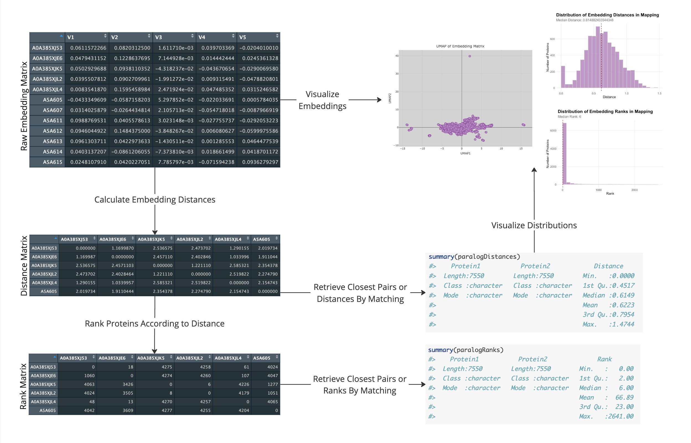

<!-- README.md is generated from README.Rmd. Please edit that file -->

# protemalyze

<!-- badges: start -->
<!-- badges: end -->

## Description

*protemalyze* is an R package designed to analyze protein embeddings
derived from protein Language Models (pLMs). Protein embeddings are
numerical representations of protein sequences, where each protein is
mapped to a fixed-length vector in a high-dimensional space (Chandra et
al., 2023). pLMs have been shown to capture essential information about
protein sequences, and predictive models trained with protein embeddings
often perform comparably to other encoding methods, despite having fewer
dimensions (Yang et al., 2018). These embeddings are particularly useful
for downstream tasks, such as identifying structurally or functionally
similar proteins (Elnaggar et al., 2021). Despite their potential, these
tools remain underutilized in the scientific community, primarily due to
a knowledge barrier. protemalyze aims to lower this barrier, providing a
more accessible entry point for researchers to explore data from pLMs
without having to engage with the technical details of the underlying
methods.

## Installation

You can install the development version of protemalyze like so:

``` r
install.packages("devtools")
library("devtools")
devtools::install_github("katarinaavucic/protemalyze", build_vignettes = TRUE)
library("protemalyze")
```

## Overview

To list all the functions available in the package:

``` r
ls("package:protemalyze")
```

To list the datasets in the package:

``` r
data(package = "protemalyze") 
```

To access tutorials for the package:

``` r
browseVignettes("protemalyze")
```

`protemalyze` contains 11 functions.

1.  ***loadEmbeddings*** for loading an embedding matrix from a “csv”,
    tsv”, or “h5” file.

2.  ***processData*** for removing NULL and duplicate values from an
    embedding matrix.

3.  ***generateDistanceMatrix*** for computing a distance matrix from an
    embedding matrix.

4.  ***generateRankMatrix*** for computing a rank matrix from an
    embedding matrix.

5.  ***getClosestPair*** for retrieving the closest pair for each
    protein in a ranked matrix.

6.  ***getFarthestPair*** for retrieving the farthest pair for each
    protein in a ranked matrix.

7.  ***getDistanceByMapping*** for retrieving the embedding distances
    from a distance matrix for protein pairs in a mapping.

8.  ***getRankByMapping*** for retrieving the embedding ranks from a
    rank matrix for protein pairs in a mapping.

9.  ***visualizeEmbeddingUMAP*** for visualizing the embedding matrix
    with an interactive plot of the UMAP created from the embedding
    matrix.

10. ***visualizeDistanceDistribution*** for visualizing the distribution
    of embedding distances from a distance matrix according to a
    mapping.

11. ***visualizeRankDistribution*** for visualizing the distribution of
    embedding ranks from a rank matrix according to a mapping.

The package also contains an embedding matrix from Escherichia coli,
called **eColiEmbeddingMatrix** and a mapping of the paralogs in
Escherichia coli, called **eColiParalogMapping**. Refer to package
vignettes for more details. An overview of the package is illustrated
below.



## Contributions

The creator and maintainer of this package is Katarina Vucic, who wrote
all of the functions.

This package relies on several external packages:

- `dplyr` and `tibble` are used for data manipulation and organizing
  data frames in the **loadEmbeddings** and **processData** functions.
  These packages make it easy to work with data in a clean and readable
  format.

- `readr` and `rhdf5` are used to import data in the **loadEmbeddings**
  function. `readr` handles reading CSV files, while `rhdf5` is used for
  loading data stored in HDF5 format, which is useful for larger
  datasets.

- `ggplot2` is used to create visualizations in the functions
  **visualizeDistanceDistribution** and **visualizeRankDistribution**.
  These functions help show the distribution of distances and ranks
  across the data.

- `plotly` and `umap` are used in the **visualizeEmbeddingUMAP**
  function to create interactive visualizations. They reduce the data to
  a lower-dimensional space and provide an interactive UMAP plot to
  explore protein relationships.

- `parallelDist` is used in **generateDistanceMatrix** to efficiently
  calculate the distance matrix, using parallel processing to handle
  large datasets.

- `matrixStats` is used in **generateRankMatrix** to quickly compute
  ranks for the distance matrix. This package provides fast methods for
  calculating ranks on large data.

Raw per-protein embeddings for E. coli, stored in
**eColiEmbeddingMatrix**, were generated by Uniprot (Batemen et al.,
2022). The one-to-many paralog mapping for E. coli, stored in
**eColiParalogMapping**, were generated using the Orthologous Matrix
(OMA) Browser (Altenhoff et al., 2018).

## References

- [Altenhoff, A. M., Glover, N. M., Train, C. M., Kaleb, K., Warwick
  Vesztrocy, A., Dylus, D., de Farias, T. M., Zile, K., Stevenson, C.,
  Long, J., Redestig, H., Gonnet, G. H., & Dessimoz, C. (2018). The OMA
  orthology database in 2018: retrieving evolutionary relationships
  among all domains of life through richer web and programmatic
  interfaces. Nucleic Acids Research, 46(D1),
  D477-D485.](https://pubmed.ncbi.nlm.nih.gov/29106550/)
- [Bateman, A., Martin, M.-J., Orchard, S., Magrane, M., Ahmad, S.,
  Alpi, E., Bowler-Barnett, E. H., Britto, R., Bye-A-Jee, H., Cukura,
  A., Denny, P., Dogan, T., Ebenezer, T., Fan, J., Garmiri, P., da Costa
  Gonzales, L. J., Hatton-Ellis, E., Hussein, A., Ignatchenko, A., &
  Insana, G. (2022). UniProt: the Universal Protein Knowledgebase
  in 2023. Nucleic Acids Research,
  51(D1).](https://doi.org/10.1093/nar/gkac1052)
- [Bengtsson H (2023). matrixStats: Functions that Apply to Rows and
  Columns of Matrices (and to Vectors). R package version
  1.0.0.](https://CRAN.R-project.org/package=matrixStats)
- [Chandra, A. A., Tünnermann, L., Löfstedt, T., & Grätz, R. (2023).
  Transformer-based deep learning for predicting protein properties in
  the life sciences. ELife, 12.](https://doi.org/10.7554/elife.82819)
- [Eckert A (2023). parallelDist: Parallel Distance Matrix Computation
  using Multiple Threads. R package version
  0.2.6.](https://CRAN.R-project.org/package=parallelDist)
- [Elnaggar, A., Heinzinger, M., Dallago, C., Rehawi, G., Wang, Y.,
  Jones, L., Gibbs, T., Feher, T., Angerer, C., Steinegger, M., Bhowmik,
  D., & Rost, B. (2021). ProtTrans: Towards Cracking the Language of
  Lifes Code Through Self-Supervised Deep Learning and High Performance
  Computing. IEEE Transactions on Pattern Analysis and Machine
  Intelligence, 44(10), 1–1.](ttps://doi.org/10.1109/tpami.2021.3095381)
- [Fischer B, Smith M, Pau G (2023). rhdf5: R Interface to HDF5. R
  package version
  2.44.0.](https://bioconductor.org/packages/release/bioc/html/rhdf5.html)
- [Inc., P. T. (2015). plotly. Collaborative data science. Montreal, QC:
  Plotly Technologies Inc](https://plot.ly)
- [Konopka T (2023). umap: Uniform Manifold Approximation and
  Projection. R package version
  0.2.10.0](https://github.com/tkonopka/umap)
- [Müller K, Wickham H (2023). tibble: Simple Data Frames. R package
  version 3.2.1.](https://CRAN.R-project.org/package=tibble)
- [Sievert C (2023). plotly: Create Interactive Web Graphics via
  ‘plotly.js’. R package version
  4.10.2.](https://CRAN.R-project.org/package=plotly)
- [Wickham H, François R, Henry L, Müller K, Vaughan D (2023). dplyr: A
  Grammar of Data Manipulation. R package version
  1.1.3.](https://CRAN.R-project.org/package=dplyr)
- [Wickham H, Chang W, Henry L, Pedersen TL, Takahashi K, Wilke C, Woo
  K, Yutani H, Dunnington D (2023). ggplot2: Create Elegant Data
  Visualisations Using the Grammar of Graphics. R package version
  3.4.3.](https://CRAN.R-project.org/package=ggplot2)
- [Wickham H, Hester J, Bryan J (2023). readr: Read Rectangular Text
  Data. R package version
  2.1.4.](https://CRAN.R-project.org/package=readr)
- [Yang, K. K., Wu, Z., Bedbrook, C. N., & Arnold, F. H. (2018). Learned
  protein embeddings for machine learning. Bioinformatics, 34(15),
  2642–2648.](https://doi.org/10.1093/bioinformatics/bty178)

## Acknowledgements

This package was developed as part of an assessment for 2024 BCB410H:
Applied Bioinformatics course at the University of Toronto, Toronto,
CANADA. protemalyze welcomes issues, enhancement requests, and other
contributions. To submit an issue, use the GitHub issues.
